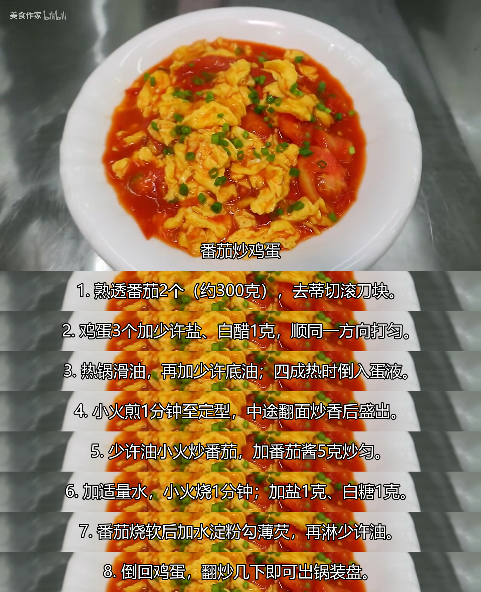
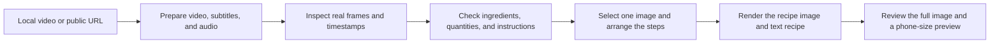

<a id="readme-top"></a>

<div align="center">
  <h1>Video Recipe Extractor</h1>
  <p>Extract ingredients and cooking instructions from cooking videos, subtitles, and real video frames, then create a caption-style recipe image with one video frame at the top and written steps below. Preserve the source's quantities, omit unsupported measurements, and use no additional step illustrations.</p>
  <p><strong>Turn a cooking video into a recipe you can follow</strong><br>
  <sub>One real video image · Step-by-step instructions · Original quantities</sub></p>
  <p><code>video-recipe-extractor</code></p>
  <p><a href="README.md">中文</a> · English</p>
  <p>
    <a href="#what-it-does">Features</a> &nbsp;·&nbsp;
    <a href="#example">Example</a> &nbsp;·&nbsp;
    <a href="#quick-start"><strong>Quick start</strong></a> &nbsp;·&nbsp;
    <a href="#example-prompts">Example prompts</a> &nbsp;·&nbsp;
    <a href="#command-line">Command line</a>
  </p>
</div>

## What it does

- **Extract recipes from cooking videos:** Provide a local video or public URL. The Agent uses subtitles, narration, and real video frames to identify ingredients, the order of additions, heat settings, and important cooking times.
- **One image above the steps:** A real video frame appears at the top, with the dish name near its bottom edge. Written instructions follow in white text with a black outline. The strips have no gaps and reuse crops of the same image as their backgrounds.
- **Keep the video's quantities:** Preserve expressions such as “2 eggs,” “a spoonful,” or “a little.” Keep gram amounts when the source explicitly gives them. Omit unsupported numbers rather than inventing measurements or displaying “unknown” in the finished image.
- **Keep the details needed to cook:** Capture the sequence, low or high heat, stated cooking times, and signs that the dish is ready. Each step references a subtitle segment or video frame for review.
- **Call the Skill with one prompt:** In Codex, the Agent interprets the video while the scripts prepare materials and render the layout. No additional model API key is required.

The default width is **1440 pixels**. The top image scales proportionally, and the total height grows with the steps. Long sentences can wrap. The image is not forced into a fixed aspect ratio, and no extra step photos are added.

## Example

**Tomato and egg stir-fry | One image of the finished dish and 8 cooking steps**

<div align="center">
  <a href="examples/tomato-eggs/recipe.jpg">
    
  </a>
</div>

Source: [美食作家王刚R's tomato and egg stir-fry video](https://www.bilibili.com/video/BV13p411d7oQ/). The top image comes from **02:08**, and the finished image measures **1440 × 1770**. This example uses the original 1080p video. The burned-in subtitles were checked frame by frame to compile the steps, and the creator's watermark is retained.

The recipe text was written and added after reviewing the video. Ingredient quantities, seasoning order, and actions such as thickening the sauce lightly before returning the eggs were checked against real frames. **The steps in the example image and its accompanying recipe are in Chinese.**

[View the full-size image](examples/tomato-eggs/recipe.jpg) · [View ingredients, instructions, and evidence timestamps](examples/tomato-eggs/recipe.md)

## Quick start

### 1. Install the Skill

Clone the renamed repository while keeping the installed skill directory name:

```bash
git clone https://github.com/cloudwallker/video-recipe-extractor-skill.git video-recipe-extractor
```

Download this project and copy the entire `video-recipe-extractor` folder into Codex's Skills directory. Run the following commands from the **parent directory** of that folder.

**Windows / PowerShell:**

```powershell
$skillsDir = Join-Path $HOME ".codex/skills"
New-Item -ItemType Directory -Force -Path $skillsDir | Out-Null
Copy-Item -LiteralPath ".\video-recipe-extractor" -Destination $skillsDir -Recurse
```

**macOS / Linux:**

```bash
mkdir -p ~/.codex/skills
cp -R video-recipe-extractor ~/.codex/skills/
```

After installation, confirm that `~/.codex/skills/video-recipe-extractor/SKILL.md` exists. If you use a custom `CODEX_HOME`, copy the folder into its `skills` directory instead. For other tools that support the Agent Skills format, follow that tool's installation instructions.

### 2. Install dependencies and check the environment

Enter the project folder, install the Python dependency, and check the environment:

```bash
python -m pip install -r requirements.txt
python scripts/prepare_video.py check
```

You need **Python 3.9+, Pillow, FFmpeg, FFprobe, and a Chinese font**. FFmpeg and FFprobe must be available from your terminal. The renderer tries common system fonts by default; you can also specify a font with `--font`.

For online video URLs, install `yt-dlp` as well:

```bash
python -m pip install yt-dlp
```

On macOS or Linux, replace `python` with `python3` if needed. The environment check only reports available components; it does not install software.

### 3. Open a new chat and give one prompt

```text
Use $video-recipe-extractor to turn this cooking video into a recipe image:
put one frame of the finished dish at the top, list the steps below,
and preserve the quantities given in the video.
```

Then provide the video URL or local file path. The Agent prepares the materials, checks the ingredients and instructions, selects the top image, and creates the recipe image and text recipe.

## Example prompts

| Situation | What to ask the Agent |
| --- | --- |
| A video URL | Use $video-recipe-extractor to turn this cooking video into a recipe image with one top image and written steps below. |
| A local video | Use $video-recipe-extractor to read this local video, extract the ingredients, heat settings, and instructions, and create a caption-style recipe image. |
| A text recipe only | Use $video-recipe-extractor to extract the ingredients and instructions from this video. Deliver only the text recipe for now. |
| A video with subtitles | Use $video-recipe-extractor to review this video and its timed subtitles, check the quantities, and create a recipe image. |
| An existing layout | Use $video-recipe-extractor to render this recipe.json and its video frames again, keeping one image at the top and written steps below. |

If a video contains several dishes, separate them into individual recipes, with one image per dish. If only subtitles are available and there are no real video frames, start with a text recipe.

## Workflow



`prepare_video.py` downloads materials, extracts frames, and builds the timeline. The Agent interprets the video, checks the content, and writes `recipe.json`. `render_recipe.py` renders the image from that recipe. Understanding the content between these script stages requires the Agent.

## Command line

Run these commands from the project folder, replacing the video, subtitle, and output paths with your own. You can also invoke the scripts using absolute paths.

### Fetch an online video

```bash
python scripts/prepare_video.py fetch "VIDEO_URL" --out-dir work/source
```

The video and subtitles are fetched separately, and source information is saved in `metadata.json`. Use the video named by its `video_path` field for the next stage. The `subtitle_paths` and `subtitle_status` fields record subtitle availability.

### Prepare local materials

```bash
python scripts/prepare_video.py prepare "video.mp4" --subtitles "video.srt" --out-dir work/evidence
```

SRT and VTT subtitles are supported. If there is no separate subtitle file, omit `--subtitles` and inspect burned-in subtitles or use speech transcription to continue.

By default, frames are sampled every 10 seconds, up to 24 frames. For longer videos, the script samples evenly from that set of time points. To inspect briefly displayed quantities or transitions, extract additional frames into a new directory:

```bash
python scripts/prepare_video.py prepare "video.mp4" --out-dir work/focused --at 90.5 --at 93 --at 128
```

This stage produces real frames, a frame overview, `evidence.json`, and `transcript.md`. It also exports `audio.wav` when the video has an audio track. These materials support review; the final image uses only the selected top frame.

### Write the recipe and render it

Have the Agent review the materials and write `work/recipe.json` using the [recipe and evidence format](references/recipe-format.md), then run:

```bash
python scripts/render_recipe.py work/recipe.json --evidence work/evidence/evidence.json --out work/recipe-long-image.jpg
```

Common layout options:

| Option | Purpose | Default |
| --- | --- | --- |
| `--width` | Image width; the top image scales proportionally | `1440` |
| `--font` | Path to a Chinese font file | Search common system fonts |
| `--font-size` | Set the text size | Scales with image width |
| `--hero-bottom` | Fraction of the original top image's height to retain | `1.0`, retain the full frame |
| `--band-center` | Vertical position in the top image used for strip backgrounds | `0.85` |

The example uses `--band-center 0.45`. Inspect the frame before cropping it, preserving the dish and the creator's watermark. Use `--help` to see all options.

The materials output directory must be empty, and the renderer will not overwrite an existing image or matching companion files. Use a new directory or filename for each revision.

<details>
<summary><strong>Optional: transcribe speech when subtitles are unavailable</strong></summary>

Install the optional component:

```bash
python -m pip install faster-whisper
```

Explicitly enable transcription:

```bash
python scripts/prepare_video.py prepare "video.mp4" --out-dir work/asr --transcribe --model base
```

The model is downloaded if it is not cached. `--model` can also point to a local model directory. Use the transcript to locate content, then check ingredient quantities and key actions against real video frames.

</details>

## Output files

| File | Purpose |
| --- | --- |
| Recipe image, `.jpg` / `.png` | One video image followed by written cooking steps |
| Matching `.md` | Ingredients, instructions, and evidence timestamps |
| `recipe.json` | The Agent-written dish name, top-frame reference, ingredients, and steps; editable for another render |
| Matching `.layout.json` | Image dimensions, font size, strip positions, and line wrapping |
| `evidence.json` and real frames | Review the source content or choose another top image |

By default, ingredient preparation is included in the first one or two steps, without a separate large ingredient table in the image. The text recipe contains the ingredient list.

## FAQ

<details>
<summary><strong>Can it work without a separate subtitle file?</strong></summary>

Start by checking for burned-in subtitles. The tomato and egg example was created by reading those subtitles frame by frame. If the video only has spoken narration, you can use optional transcription. If only part of the content can be confirmed, start with the information that is available.

</details>

<details>
<summary><strong>Why aren't all quantities converted to grams?</strong></summary>

The recipe preserves the video's wording. Gram amounts are kept when provided; expressions such as “a spoonful,” “as needed,” and “a little” are retained. Without evidence for a quantity, only the ingredient name is listed. You can explicitly request additional quantity suggestions, which will be marked separately from facts in the video.

</details>

<details>
<summary><strong>Can it download every Bilibili or other platform link?</strong></summary>

This page shows the result of processing one Bilibili video. Whether another link can be fetched depends on `yt-dlp` support, platform access, and your network environment. If a download fails, the failed stage is reported; you can also continue with a local video. Browser cookies and login credentials are not read by default.

</details>

## Project structure

```text
video-recipe-extractor/
├── SKILL.md                      Skill entry point and workflow
├── README.md                     Chinese guide
├── README_EN.md                  English guide
├── requirements.txt              Core Python dependency
├── agents/openai.yaml            Codex UI metadata
├── scripts/
│   ├── prepare_video.py          Fetch materials, index subtitles, and extract frames
│   └── render_recipe.py          Validate the recipe and render its layout
├── references/recipe-format.md   Recipe and evidence format
├── examples/tomato-eggs/         Tomato and egg video example
└── tests/                        Automated tests
```

## Development checks

```bash
python -m unittest discover -s tests -v
```

The 34 automated tests cover preserving subtitle quantities, deduplicating rolling subtitles, frame timing, videos with and without audio, evidence references, long-sentence wrapping, and overwrite protection. The tomato and egg example was also checked against real frames and reviewed at full size and as a phone-size preview.


## License and media sources

Original code and skill documentation are released under the [MIT License](LICENSE), © 2026 [cloudwallker](https://github.com/cloudwallker). The example video frame and author watermark belong to their original creator; the [source video](https://www.bilibili.com/video/BV13p411d7oQ/) remains attributed and is not relicensed under MIT. Third-party dependencies and user-provided materials retain their respective rights and licenses.

<div align="right"><a href="#readme-top">↑ Back to top</a></div>
